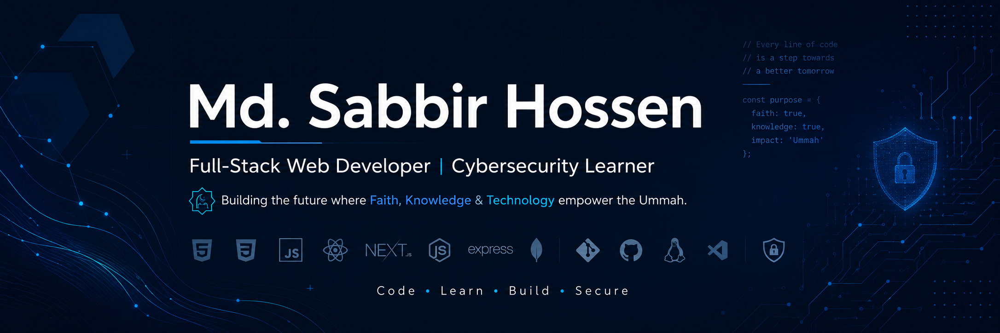

  

  <h1>Hi 👋, I'm Md. Sabbir Hossen</h1>
  <strong>Full-Stack Web Developer • Cybersecurity Learner • Lifelong Student</strong> 
  Building the future where <strong>Faith, Knowledge & Technology</strong> empower the Ummah.

---

## 🚀 About Me

I'm a Bangladeshi student currently studying Arabic at the **Islamic University of Madinah (Saudi Arabia)** while pursuing a career in **Software Engineering**.

I enjoy designing modern web applications, solving real-world problems through code, and continuously learning new technologies. My goal is to become a professional **Full-Stack Developer** while building solutions with purpose.

I believe technology should be created with intention—to solve problems and create meaningful impact.

---

## 🌱 Currently Learning & Building

- 🚀 Building production-ready **MERN Stack** applications
- 📚 Mastering **React, Next.js, Node.js & Express.js**
- 🔒 Exploring **Cybersecurity, OSINT & Ethical Hacking**
- 🎓 Studying Arabic at the Islamic University of Madinah
- ✨ Building my personal brand and developer portfolio

---

## 💻 Tech Stack

### Frontend

  
 
 
 
 

### Backend

 
 
 

### Languages & Databases

 
 
 

### Tools & Platforms

 
 
 

### Currently Learning

 
 

---

## 📌 Featured Projects

### 🌐 Digital Life Lessons
A comprehensive platform where users can create, share, and discover meaningful life lessons and personal growth insights. Built with React, Node.js, Express, MongoDB, Firebase, and Stripe.
- 🔗 **Live Demo:**  [PROJECT_LINK](https://digital-life-lessons-client.vercel.app/)
- 🔗 **Repository:** [Digital_Life_Lessons_REPO_LINK](https://github.com/MSabbirHossen/Digital-Life-Lessons.git)

### Import Export Hub
A full-stack MERN marketplace platform that connects exporters with importers. Browse products, manage listings, and streamline the import-export process.
- 🔗 **Live Demo:** [PROJECT_LINK](https://import-export-hub-client.vercel.app/)
- 🔗 **Repository:** [Import_Export_Hub_REPO_LINK](https://github.com/MSabbirHossen/export-import-project.git)

### GameHub - Online Game Library
A vibrant, urban-themed web application for discovering, exploring, and downloading indie games and AAA titles. GameHub provides an engaging platform for gamers to browse games, view detailed information, and connect with gaming communities.
- 🔗 **Live Demo:** [PROJECT_LINK](https://online-game-library.web.app/)
- 🔗 **Repository:** [GameHub_REPO_LINK](https://github.com/MSabbirHossen/Online-Game-Library.git)

---

## 📈 GitHub Analytics

 

                
              

              

                
              

---

## 🏆 Certifications & Achievements

- ✅ IELTS Academic — Band 7.0
- ✅ HTML & CSS (Real-World Projects)
- ✅ Basic IT Course
- 🚧 More certifications coming soon...

---

## 🤝 Let's Connect

  
  &nbsp;&nbsp;
  
  &nbsp;&nbsp;
  
  &nbsp;&nbsp;
  &nbsp;&nbsp;
  

---

## 📍 Contact Information

| Field | Details |
|-------|---------|
| 📍 **Location** | Madinah, Saudi Arabia |
| 📧 **Email** | mshossen724@gmail.com |
| 🌐 **Portfolio** | [PORTFOLIO_URL](https://portfolio-mshossen.netlify.app/) |
| 💼 **LinkedIn** | [LINKEDIN_Profile](https://web.facebook.com/sabb1rhossen/) |

---

  <i>"Learner by heart, dreamer by soul — building a future where Faith, Knowledge & Technology empower the Ummah."</i>

